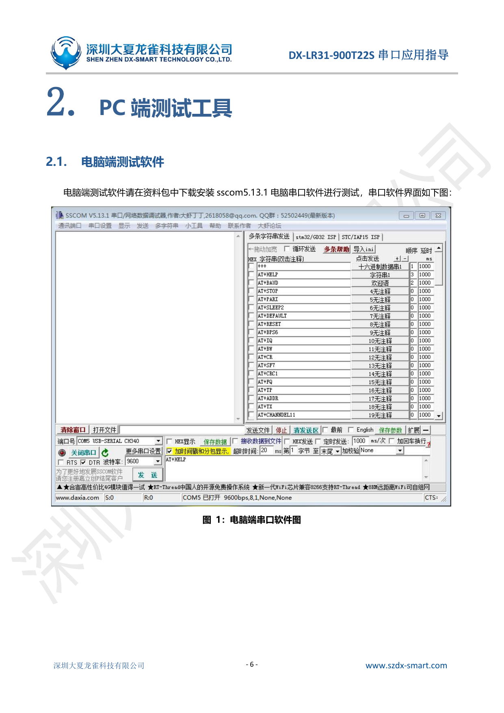
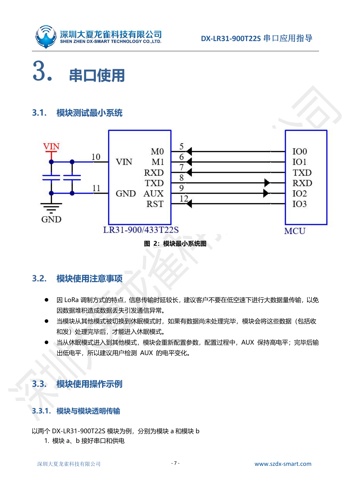
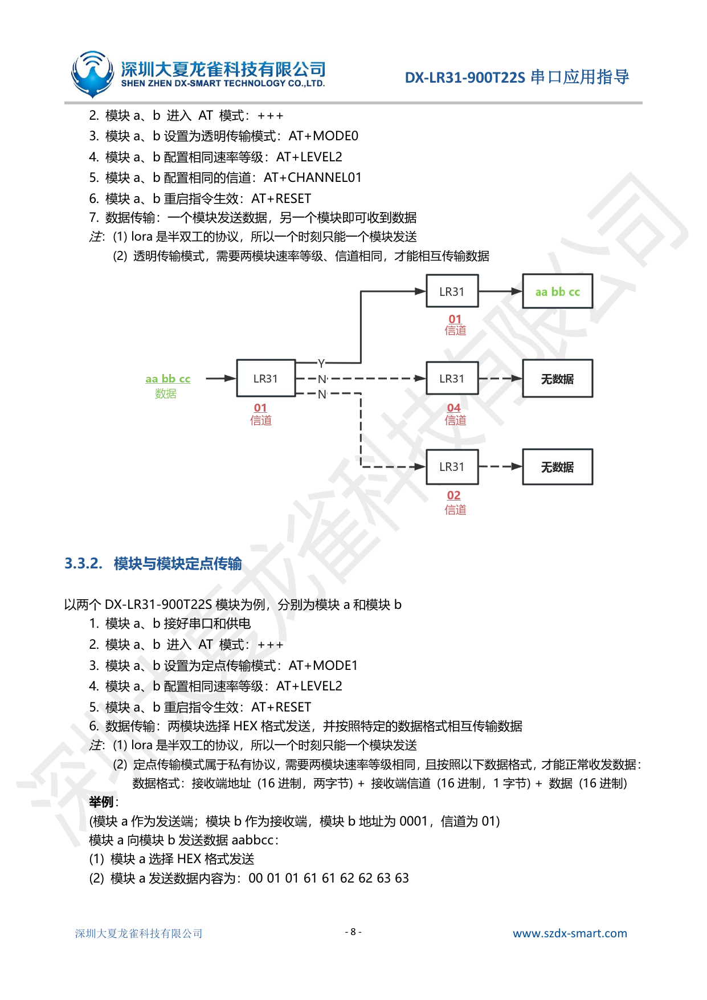
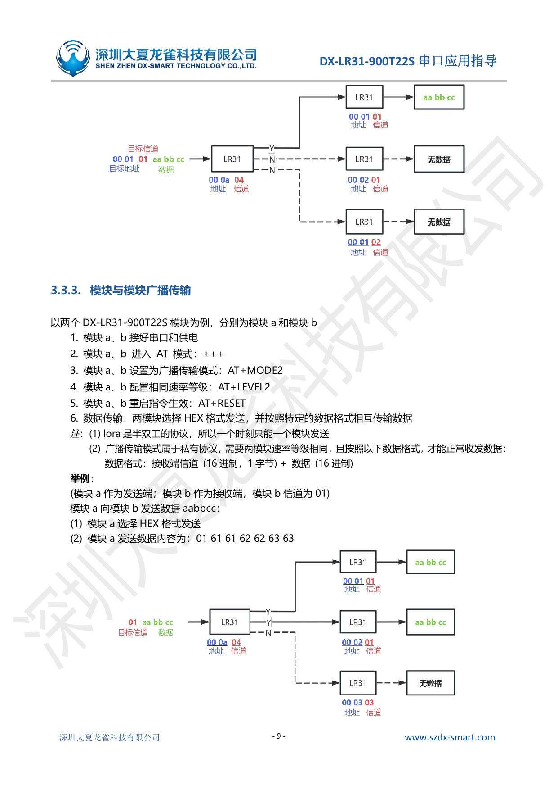
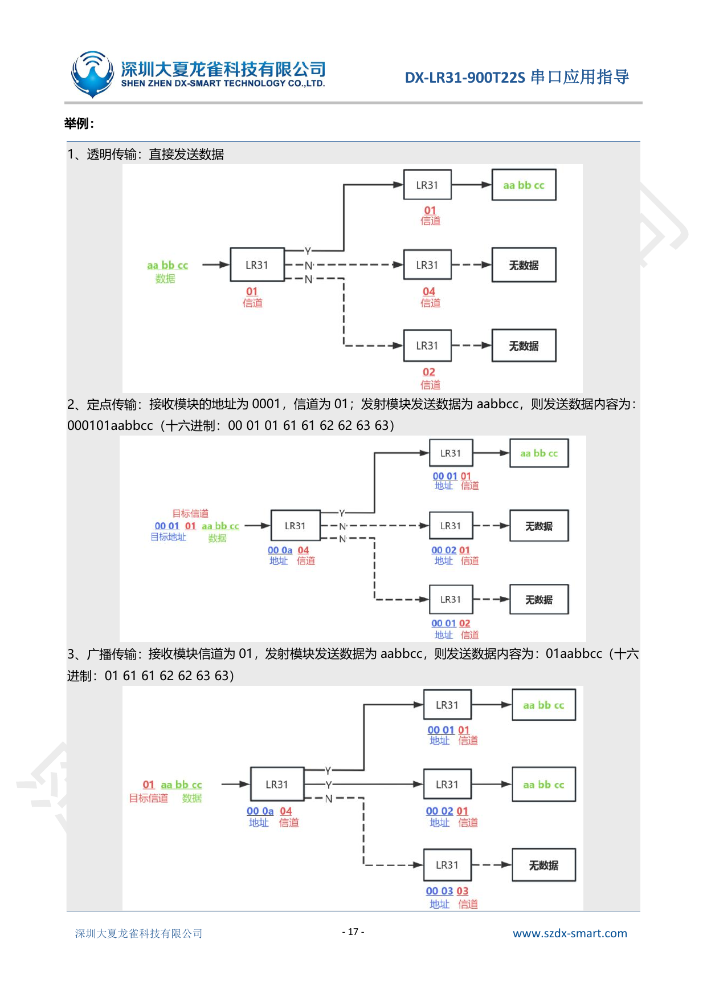

# DX-LR31-900T22S 串口应用指导

- **版本**：3.3
- **日期**：2026-01-24
- **公司**：深圳大夏龙雀科技有限公司

---

## 更新记录

| 版本 | 日期 | 说明 | 作者 |
|---|---|---|---|
| V1.0 | 2025/03/17 | 初始版本 | SML |
| V1.1 | 2025/04/14 | 优化参数 | SML |
| V2.0 | 2025/06/20 | 新增指令说明 | SML |
| V2.1 | 2025/09/10 | 新增指令 | SML |
| V3.0 | 2025/10/22 | 修改参数单位；更新模块使用操作示例；修改指令描述和备注 | SML |
| V3.1 | 2025/11/13 | 修改指令描述 | SML |
| V3.2 | 2025/12/31 | 修改文字说明 | SML |
| V3.3 | 2026/01/24 | 新增指令 `AT+IQ`、`AT+CRC`；修改 `AT+HELP` 参数 | SML |

## 联系我们

- **公司**：深圳大夏龙雀科技有限公司
- **邮箱**：sales@szdx-smart.com
- **电话**：0755-2997 8125
- **网址**：www.szdx-smart.com
- **地址**：深圳市宝安区航城街道航空路华丰智谷 A1 座 601

---

## 目录

1. [引言](#1-引言)
2. [PC 端测试工具](#2-pc-端测试工具)
3. [串口使用](#3-串口使用)
4. [相关 AT 命令详解](#4-相关-at-命令详解)
5. [AT 命令详解](#5-at-命令详解)
6. [增值服务](#6-增值服务)

---

# 1. 引言

DX-LR31-900T22S 是一款低功耗 LoRa 模组，采用 Semtech SX1262 芯片，芯片内部集成了 Sub-1GHz 的射频收发机。模块支持 UART 接口，支持 IO 口控制，具有低功耗、高性能、远距离等优点。

适用于 IoT 领域的多种应用场景，例如：

- 智能表计
- 智能物流
- 智能建筑
- 智慧城市
- 智慧农业

## 1.1 串口基本参数

- 模块串口默认参数：`9600bps / 8 / n / 1`（波特率 / 数据位 / 无校验 / 停止位）

## 1.2 模块默认射频基本参数

| 参数 | 默认值 |
|---|---|
| 模块速率等级 | LEVEL2（2148bps） |
| 模块模式切换方式 | 方式一（AT 指令控制） |
| 模块分包长度 | 230 bytes |
| 模块数据包 RSSI | 关闭 |
| 模块密钥 | 12345 |
| 模块频段 | 915.15MHz |
| 模块发射功率 | 22dBm |
| 模块工作模式 | 透明传输 |
| 模块功耗模式 | 高时效模式 |
| 模块地址 | ffff |
| 模块 CAD 检测时长 | 4s |

## 1.3 传输模式和 AT 命令模式

| 模式 | 说明 |
|---|---|
| 传输模式 | 模块在上电后即为传输模式，此时可以开始传输数据。 |
| AT 命令模式 | 在传输模式下，使用 `+++` 切换为 AT 命令模式，可以响应 AT 命令。如需进入传输模式，需发送 `+++` 退出 AT 命令模式。 |

---

# 2. PC 端测试工具

## 2.1 电脑端测试软件

电脑端测试软件请在资料包中下载安装 `sscom5.13.1` 电脑串口软件进行测试。



---

# 3. 串口使用

## 3.1 模块测试最小系统



## 3.2 模块使用注意事项

- 因 LoRa 调制方式的特点，信息传输时延较长，建议客户不要在低空速下进行大数据量传输，以免因数据堆积造成数据丢失，引发通信异常。
- 当模块从其他模式被切换到休眠模式时，如果有数据尚未处理完毕，模块会将这些数据（包括收和发）处理完毕后，才能进入休眠模式。
- 当从休眠模式进入到其他模式，模块会重新配置参数。配置过程中，AUX 保持高电平；配置完毕后输出低电平，所以建议用户检测 AUX 的电平变化。

## 3.3 模块使用操作示例

### 3.3.1 模块与模块透明传输

以两个 DX-LR31-900T22S 模块为例，分别为模块 a 和模块 b。

1. 模块 a、b 接好串口和供电。
2. 模块 a、b 进入 AT 模式：`+++`
3. 模块 a、b 设置为透明传输模式：`AT+MODE0`
4. 模块 a、b 配置相同速率等级：`AT+LEVEL2`
5. 模块 a、b 配置相同的信道：`AT+CHANNEL01`
6. 模块 a、b 重启指令生效：`AT+RESET`
7. 数据传输：一个模块发送数据，另一个模块即可收到数据。

**注意：**

- LoRa 是半双工协议，所以一个时刻只能一个模块发送。
- 透明传输模式下，两模块需要速率等级、信道相同，才能相互传输数据。



### 3.3.2 模块与模块定点传输

以两个 DX-LR31-900T22S 模块为例，分别为模块 a 和模块 b。

1. 模块 a、b 接好串口和供电。
2. 模块 a、b 进入 AT 模式：`+++`
3. 模块 a、b 设置为定点传输模式：`AT+MODE1`
4. 模块 a、b 配置相同速率等级：`AT+LEVEL2`
5. 模块 a、b 重启指令生效：`AT+RESET`
6. 数据传输：两模块选择 HEX 格式发送，并按照特定的数据格式相互传输数据。

**注意：**

- LoRa 是半双工协议，所以一个时刻只能一个模块发送。
- 定点传输模式属于私有协议，需要两模块速率等级相同，且按照以下数据格式，才能正常收发数据。

**数据格式：**

```text
接收端地址（16 进制，两字节） + 接收端信道（16 进制，1 字节） + 数据（16 进制）
```

**举例：**

模块 a 作为发送端；模块 b 作为接收端。模块 b 地址为 `0001`，信道为 `01`。

模块 a 向模块 b 发送数据 `aabbcc`：

1. 模块 a 选择 HEX 格式发送。
2. 模块 a 发送数据内容为：`00 01 01 61 61 62 62 63 63`

### 3.3.3 模块与模块广播传输

以两个 DX-LR31-900T22S 模块为例，分别为模块 a 和模块 b。

1. 模块 a、b 接好串口和供电。
2. 模块 a、b 进入 AT 模式：`+++`
3. 模块 a、b 设置为广播传输模式：`AT+MODE2`
4. 模块 a、b 配置相同速率等级：`AT+LEVEL2`
5. 模块 a、b 重启指令生效：`AT+RESET`
6. 数据传输：两模块选择 HEX 格式发送，并按照特定的数据格式相互传输数据。

**注意：**

- LoRa 是半双工协议，所以一个时刻只能一个模块发送。
- 广播传输模式属于私有协议，需要两模块速率等级相同，且按照以下数据格式，才能正常收发数据。

**数据格式：**

```text
接收端信道（16 进制，1 字节） + 数据（16 进制）
```

**举例：**

模块 a 作为发送端；模块 b 作为接收端。模块 b 信道为 `01`。

模块 a 向模块 b 发送数据 `aabbcc`：

1. 模块 a 选择 HEX 格式发送。
2. 模块 a 发送数据内容为：`01 61 61 62 62 63 63`



### 3.3.4 模式切换

#### 3.3.4.1 方式一：通过 AT 指令配置工作模式

使用 `+++` 进入 AT 指令模式后，用以下指令配置所需要的模式：

| 工作模式 | 指令 |
|---|---|
| 高时效模式 | `AT+SLEEP2` |
| 空中唤醒模式 | `AT+SLEEP1` |
| 休眠模式 | `AT+SLEEP0` |

#### 3.3.4.2 方式二：通过 M0/M1 引脚配置四种工作模式

当模块指令 `AT+SWITCH=1` 时，可通过 M0/M1 引脚切换模块工作模式。

| M0 输入电平 | M1 输入电平 | 工作模式 |
|---|---|---|
| 高电平 | 高电平 | 休眠模式 |
| 高电平 | 低电平 | 空中唤醒模式 |
| 低电平 | 高电平 | AT 模式 |
| 低电平 | 低电平 | 高时效模式 |

**备注：**

1. 指令 `AT+SWITCH` 详细说明请参考 [5.3.5 设置/查询—硬件控制引脚状态](#535-设置查询硬件控制引脚状态)。
2. 指令 `AT+SWITCH=1` 时，M0/M1 引脚内部为弱上拉。通过 M0/M1 引脚切换模块工作模式时，请务必避免引脚悬空，以防止模式切换异常。

### 3.3.5 AUX 模块工作状态指示脚说明

| 引脚名 | 引脚号 | 描述 | 引脚输出电平 | 说明 |
|---|---:|---|---|---|
| AUX | 9 | 模块工作状态指示 | 高电平 | 数据发送中 / 数据接收中 / 工作模式切换中 |
| AUX | 9 | 模块工作状态指示 | 低电平 | 数据发送完成 / 数据接收完成 / 工作模式切换完成 |

**备注：**

当模块检测到接收数据时，AUX 会提前 2-3ms 输出高电平，用于提示外部 MCU 做好接收数据的准备。

---

# 4. 相关 AT 命令详解

## 4.1 命令格式说明

```text
AT+Command<param1,param2,param3><CR><LF>
```

- 所有的指令以 `AT` 开头，`<CR><LF>` 结束。在本文档中表现命令和响应的表格中，省略了 `<CR><LF>`，仅显示命令和响应。
- 所有 AT 命令字符都为英文大写。
- `<>` 内为可选内容。如果命令中有多个参数，以逗号 `,` 隔开，实际命令中不包含尖括号。
- `<CR>` 为回车字符 `\r`，十六进制为 `0x0D`。
- `<LF>` 为换行字符 `\n`，十六进制为 `0x0A`。
- 指令执行成功，返回相应命令并以 `OK` 结束；失败返回 `EEROR=<>`，`<>` 内容为对应错误码（请参考 [5.4 错误码一览表](#54-错误码一览表)。

## 4.2 回应格式说明

```text
+Indication<=param1,param2,param3><CR><LF>
```

- 回应指令以加号 `+` 开头，`<CR><LF>` 结束。
- 等号 `=` 后面为回应参数。
- 如果回应参数中有多个参数，会以逗号 `,` 隔开。

## 4.3 AT 命令举例说明

**举例：修改 LoRa 设备波特率为 9600。**

```text
发送：AT+BAUD3
返回：OK
```

## 4.4 AT 命令一览表

| 指令 | 功能 | 说明 |
|---|---|---|
| `+++` | 进入或退出 AT 命令模式 | 上电默认为传输模式 |
| `AT` | 测试指令 | 用于测试串口 |
| `AT+RESET` | 软件重启 | - |
| `AT+DEFAULT` | 恢复出厂设置 | - |
| `AT+BAUD` | 设置/查询串口波特率 | 默认：3（9600） |
| `AT+PARI` | 设置/查询串口校验位 | 默认：0（无校验） |
| `AT+HELP` | 查询配置信息 | - |
| `AT+LEVEL` | 设置/查询模块空中速率和通讯距离 | 默认：2 |
| `AT+MODE` | 设置/查询传输模式 | 默认：0（透明传输） |
| `AT+SLEEP` | 设置/查询工作模式 | 默认：2（高时效模式） |
| `AT+SWITCH` | 设置/查询硬件控制引脚状态 | 默认：0（关闭） |
| `AT+CHANNEL` | 设置/查询工作信道 | 默认：41 |
| `AT+MAC` | 设置/查询设备地址 | 默认：ff,ff |
| `AT+OPENKEY` | 设置/查询模块密钥开关 | 默认：1（打开） |
| `AT+KEY` | 设置模块密钥 | 默认：12345 |
| `AT+PACKET` | 设置/查询分包长度 | 默认：3（230 bytes） |
| `AT+DRSSI` | 设置/查询数据包 RSSI | 默认：0（关闭） |
| `AT+POWE` | 设置/查询发射功率 | 默认：22 |
| `AT+LBT` | 设置/查询 LBT 状态 | 默认：0（关闭） |
| `AT+LRSSI` | 设置/查询 LBT 监听阈值 | 默认：-100 |
| `AT+ERSSI` | 查询当前信道噪声水平 | - |
| `AT+IQ` | 设置/查询 IQ 翻转 | 默认：1（打开） |
| `AT+CRC` | 设置/查询 CRC 校验 | 默认：1（打开） |

---

# 5. AT 命令详解

## 5.1 基础指令

### 5.1.1 进入或退出 AT 命令模式

| 功能 | 指令 | 响应 | 说明 |
|---|---|---|---|
| 进入或退出 AT 命令模式 | `+++` | `Entry AT` 或 `Exit AT`；`Power On` | `Entry AT`：进入 AT 命令模式；`Exit AT`：退出 AT 命令模式；上电默认为传输模式 |

**备注：**

1. 退出 AT 命令模式时会自动复位。
2. 该指令掉电不保存。

### 5.1.2 测试指令

| 功能 | 指令 | 响应 | 说明 |
|---|---|---|---|
| 测试 | `AT` | `OK` | - |

### 5.1.3 软件重启

| 功能 | 指令 | 响应 | 说明 |
|---|---|---|---|
| 软件重启 | `AT+RESET` | `OK`；`Power On` | - |

### 5.1.4 恢复出厂设置

| 功能 | 指令 | 响应 | 说明 |
|---|---|---|---|
| 恢复出厂设置 | `AT+DEFAULT` | `OK`；`Power On` | - |

## 5.2 串口参数

### 5.2.1 设置/查询—串口波特率

| 功能 | 指令 | 响应 | 说明 |
|---|---|---|---|
| 查询波特率 | `AT+BAUD` | `+BAUD=<baud>` | `<baud>` 波特率对应序号 |
| 设置波特率 | `AT+BAUD<baud>` | `+BAUD=<baud>`；`OK` | 设置完该指令后需重启生效 |

| 序号 | 波特率 |
|---:|---:|
| 1 | 2400 |
| 2 | 4800 |
| 3 | 9600 |
| 4 | 19200 |
| 5 | 38400 |
| 6 | 57600 |
| 7 | 115200 |

默认值：`3`（9600）

### 5.2.2 设置/查询—串口校验位

| 功能 | 指令 | 响应 | 说明 |
|---|---|---|---|
| 查询串口校验位 | `AT+PARI` | `+PARI=<param>` | `<param>` 序号 |
| 设置串口校验位 | `AT+PARI<param>` | `+PARI=<param>`；`OK` | 设置完该指令后需重启生效 |

| 序号 | 校验位 |
|---:|---|
| 0 | 无校验 |
| 1 | 奇校验 |
| 2 | 偶校验 |

默认值：`0`

## 5.3 LORA 参数

### 5.3.1 查询配置信息

| 功能 | 指令 | 响应 | 说明 |
|---|---|---|---|
| 查询模块基本配置信息 | `AT+HELP` | 见下方响应格式 | 查询 LoRa 参数 |

**响应格式：**

```text
=====================
LoRa Parameter:
+VERSION=<version>
MODE:<mode>
LEVEL:<level>
SLEEP:<sleep>
Frequency:<frequency>
MAC:<mac>
CRC:<crc>
IQ:<iq>
Power:<power>
=====================
```

| 参数 | 说明 |
|---|---|
| `<version>` | 版本 |
| `<mode>` | 传输模式 |
| `<level>` | 空中速率配置 |
| `<sleep>` | 工作模式 |
| `<frequency>` | 工作频率 |
| `<mac>` | 设备地址 |
| `<crc>` | CRC 校验 |
| `<iq>` | IQ 是否翻转 |
| `<power>` | 发射功率 |

**举例：**

```text
发送：AT+HELP
返回：===================================
LoRa Parameter:
+VERSION=V1.2.3
MODE:0
LEVEL:2 >> 2149bps
SLEEP:2
Frequency:915150000hz >> 41
MAC:ff,ff
CRC:1(true)
IQ:1(true)
Power:22dBm
===================================
```

### 5.3.2 设置/查询—一键配置模块空中速率和通讯距离

| 功能 | 指令 | 响应 | 说明 |
|---|---|---|---|
| 查询模块参数 | `AT+LEVEL` | `+LEVEL=<param>` | `<param>`：0-7，共 8 个档位 |
| 设置模块参数 | `AT+LEVEL<param>` | `+LEVEL=<param>`；`OK` | 默认值：2 |

**备注：**

1. 可以根据自己的数据量和通讯距离选择不同的档位。空中字符速率越大，可发送的数据量越快，通讯距离越短。空中字符速率与距离成反比。
2. 该指令将射频带宽、射频编码率、扩频因子已经设置好，可以直接使用。
3. 发射设备与接收设备 `LEVEL` 档位需一致才可以收发数据。
4. 设置完该指令后需重启生效。
5. 下表为空旷可视距离，仅供参考，实际距离以实测为准。

| LEVEL 档位 | SF 扩频因子 | BW 带宽 KHz | CR 编码率 | 空中字符速率 bit/s | 空旷可视距离 Km |
|---:|---:|---:|---|---:|---:|
| 0 | 11 | 125 | 4/8 | 336 | 8.0 |
| 1 | 11 | 250 | 4/5 | 1075 | - |
| 2 | 11 | 500 | 4/5 | 2148 | - |
| 3 | 8 | 250 | 4/5 | 6250 | - |
| 4 | 8 | 500 | 4/6 | 10417 | - |
| 5 | 7 | 500 | 4/6 | 18229 | 2.4 |
| 6 | 6 | 500 | 4/5 | 37500 | - |
| 7 | 5 | 500 | 4/5 | 62500 | - |

### 5.3.3 设置/查询—传输模式

| 功能 | 指令 | 响应 | 说明 |
|---|---|---|---|
| 查询传输模式 | `AT+MODE` | `+MODE=<param>` | `<param>`：0、1、2 |
| 设置传输模式 | `AT+MODE<param>` | `+MODE=<param>`；`OK` | 默认设置：0 |

| 参数 | 传输模式 | 数据格式 |
|---:|---|---|
| 0 | 透明传输 | 直接发送数据 |
| 1 | 定点传输 | 设备地址（16 进制，两字节）+ 信道编号（16 进制，一字节）+ 数据（16 进制） |
| 2 | 广播传输 | 信道编号（16 进制，一字节）+ 数据（16 进制） |

**备注：** 设置完该指令后需重启生效。

**举例：**

1. 透明传输：直接发送数据。
2. 定点传输：接收模块的地址为 `0001`，信道为 `01`；发射模块发送数据为 `aabbcc`，则发送数据内容为 `000101aabbcc`（十六进制：`00 01 01 61 61 62 62 63 63`）。
3. 广播传输：接收模块信道为 `01`，发射模块发送数据为 `aabbcc`，则发送数据内容为 `01aabbcc`（十六进制：`01 61 61 62 62 63 63`）。



### 5.3.4 设置/查询—工作模式

| 功能 | 指令 | 响应 | 说明 |
|---|---|---|---|
| 查询工作模式 | `AT+SLEEP` | `+SLEEP=<param>` | `<param>` 序号 |
| 设置工作模式 | `AT+SLEEP<param>` | `+SLEEP=<param>`；`OK` | 默认值：2 |

| 参数 | 工作模式 | 说明 |
|---:|---|---|
| 0 | 休眠模式 | MCU 和射频都进入休眠状态 |
| 1 | 空中唤醒模式 | 以 4 秒为一个周期进行 CAD 检测 |
| 2 | 高时效模式 | 模块一直处于接收状态，随时可以接收其他设备的数据 |

**休眠模式：**

- 方法一：使用串口进行休眠和唤醒。发送 `AT+SLEEP0` 进入休眠模式，唤醒时发送 `AT+WAKEUP` 或者任意数据进行唤醒，唤醒后模块处于 AT 命令状态。
- 方法二：使用 M1、M0 脚位进行休眠和唤醒。发送 `AT+SWITCH1` 打开 M0、M1 模式切换，重启模块后，设置 `M0=1`、`M1=1`，进入休眠模式；任意切换 M0、M1，模块退出休眠模式。

**空中唤醒模式：**

- 模块以 4 秒为一个周期进行 CAD 检测（整体休眠时间为：4s 减去 CAD 检测时间）。如模块检测到数据，将会进入接收模式；接收完数据后，自动进入休眠。休眠期间射频休眠，MCU 不休眠。
- 使用空中唤醒模式时，接收端和发送端都应处于空中唤醒模式，才可收发数据。
- 该模式可以进行写入保存。

**CAD 说明：**

LoRa CAD（Channel Activity Detection）是 LoRa 网络中用于检测信道活动的一种技术。它用于判断指定的物理信道上是否存在活动（例如其他设备的传输），以帮助设备选择合适的发送时机和避免碰撞。

**高时效模式：**

该模式下，模块一直处于接收状态，随时可以接收到其他设备的数据。当模块串口接收到主控的数据时，即切换成发射状态，将数据发射出去；发射完成后，切换回接收状态。

**备注：** 设置完该指令后需重启生效。

### 5.3.5 设置/查询—硬件控制引脚状态

| 功能 | 指令 | 响应 | 说明 |
|---|---|---|---|
| 查询硬件控制引脚状态 | `AT+SWITCH` | `+SWITCH=<param>` | `<param>`：0、1 |
| 设置硬件控制引脚状态 | `AT+SWITCH<param>` | `+SWITCH=<param>`；`OK` | 默认值：0（关闭） |

| 参数 | 状态 |
|---:|---|
| 0 | 关闭 |
| 1 | 打开 |

**备注：**

1. 设置完该指令后需重启生效。
2. 当 `SWITCH=1` 时，可通过模块硬件引脚 M0、M1 来选择工作模式：
   - `M0=0, M1=0`：模块处于高时效模式。
   - `M0=1, M1=0`：模块处于空中唤醒模式。
   - `M0=0, M1=1`：模块处于 AT 模式。
   - `M0=1, M1=1`：模块处于休眠模式。
3. 通过引脚控制进入休眠时，无法通过串口或指令唤醒，必须通过 M0、M1 来退出休眠。
4. 当 `SWITCH=0` 时，可通过 `AT+SLEEP` 指令来选择工作模式。

### 5.3.6 设置/查询—工作信道

| 功能 | 指令 | 响应 | 说明 |
|---|---|---|---|
| 查询工作信道 | `AT+CHANNEL` | `+CHANNEL=<param>` | `<param>`：00-63（十六进制） |
| 设置工作信道 | `AT+CHANNEL<param>` | `+CHANNEL=<param>`；`OK` | 默认设置：41 |

说明：以 850.15MHz 为起始，信道间隔 1MHz。

**备注：**

1. 本模块设置了 100 个通用信道，如需更多可联系厂家。
2. 设置完该指令后需重启生效。
3. 多个接收设备离发射设备距离过近时，有可能导致不同信道的接收设备都能接收到数据，所以要求发射设备和接收设备之间的距离尽量远。

**不同信道的工作频段对照表（单位：MHz）：**

| 信道 | 工作频段 | 信道 | 工作频段 | 信道 | 工作频段 | 信道 | 工作频段 |
|---|---:|---|---:|---|---:|---|---:|
| 00 | 850.15 | 19 | 875.15 | 32 | 900.15 | 4B | 925.15 |
| 01 | 851.15 | 1A | 876.15 | 33 | 901.15 | 4C | 926.15 |
| 02 | 852.15 | 1B | 877.15 | 34 | 902.15 | 4D | 927.15 |
| 03 | 853.15 | 1C | 878.15 | 35 | 903.15 | 4E | 928.15 |
| 04 | 854.15 | 1D | 879.15 | 36 | 904.15 | 4F | 929.15 |
| 05 | 855.15 | 1E | 880.15 | 37 | 905.15 | 50 | 930.15 |
| 06 | 856.15 | 1F | 881.15 | 38 | 906.15 | 51 | 931.15 |
| 07 | 857.15 | 20 | 882.15 | 39 | 907.15 | 52 | 932.15 |
| 08 | 858.15 | 21 | 883.15 | 3A | 908.15 | 53 | 933.15 |
| 09 | 859.15 | 22 | 884.15 | 3B | 909.15 | 54 | 934.15 |
| 0A | 860.15 | 23 | 885.15 | 3C | 910.15 | 55 | 935.15 |
| 0B | 861.15 | 24 | 886.15 | 3D | 911.15 | 56 | 936.15 |
| 0C | 862.15 | 25 | 887.15 | 3E | 912.15 | 57 | 937.15 |
| 0D | 863.15 | 26 | 888.15 | 3F | 913.15 | 58 | 938.15 |
| 0E | 864.15 | 27 | 889.15 | 40 | 914.15 | 59 | 939.15 |
| 0F | 865.15 | 28 | 890.15 | 41 | 915.15 | 5A | 940.15 |
| 10 | 866.15 | 29 | 891.15 | 42 | 916.15 | 5B | 941.15 |
| 11 | 867.15 | 2A | 892.15 | 43 | 917.15 | 5C | 942.15 |
| 12 | 868.15 | 2B | 893.15 | 44 | 918.15 | 5D | 943.15 |
| 13 | 869.15 | 2C | 894.15 | 45 | 919.15 | 5E | 944.15 |
| 14 | 870.15 | 2D | 895.15 | 46 | 920.15 | 5F | 945.15 |
| 15 | 871.15 | 2E | 896.15 | 47 | 921.15 | 60 | 946.15 |
| 16 | 872.15 | 2F | 897.15 | 48 | 922.15 | 61 | 947.15 |
| 17 | 873.15 | 30 | 898.15 | 49 | 923.15 | 62 | 948.15 |
| 18 | 874.15 | 31 | 899.15 | 4A | 924.15 | 63 | 949.15 |

### 5.3.7 设置/查询—设备地址

| 功能 | 指令 | 响应 | 说明 |
|---|---|---|---|
| 查询设备地址 | `AT+MAC` | `+MAC=<param>,<param>` | `<param>`：十六进制，一个字节 |
| 设置设备地址 | `AT+MAC<param>,<param>` | `+MAC=<param>,<param>`；`OK` | 默认设置：ff,ff |

**备注：** 设置完该指令后需重启生效。

**举例：将模块地址设置为 `0a01`。**

```text
发送：AT+MAC0a,01
返回：+MAC=0a,01
OK
```

### 5.3.8 设置/查询—模块密钥开关

| 功能 | 指令 | 响应 | 说明 |
|---|---|---|---|
| 查询模块密钥开关 | `AT+OPENKEY` | `+OPENKEY=<param>` | `<param>`：0、1 |
| 设置模块密钥开关 | `AT+OPENKEY<param>` | `+OPENKEY=<param>`；`OK` | 默认值：1 |

| 参数 | 状态 |
|---:|---|
| 0 | 关闭密钥 |
| 1 | 开启密钥 |

**备注：**

1. 设置完该指令后需重启生效。
2. `AT+OPENKEY=0` 时，可以关闭密钥功能，但是不会清除已设置的密钥。
3. 收发双方的 `OPENKEY` 必须保持一致，否则会收发异常。

### 5.3.9 设置—模块密钥

| 功能 | 指令 | 响应 | 说明 |
|---|---|---|---|
| 设置模块密钥 | `AT+KEY<param>` | `+KEY=<param>`；`OK` | `<param>`：0-65535；默认值：12345 |

**备注：**

1. 设置完该指令后需重启生效。
2. 该指令只可设置不可查询。
3. 收发双方的密钥必须保持一致，否则会收发异常。
4. 如需将 key 值恢复默认，需发送 `AT+DEFAULT`，将模块所有参数恢复为默认值。

### 5.3.10 设置/查询—分包长度

| 功能 | 指令 | 响应 | 说明 |
|---|---|---|---|
| 查询分包长度 | `AT+PACKET` | `+PACKET=<param>` | `<param>`：0-3 |
| 设置分包长度 | `AT+PACKET<param>` | `+PACKET=<param>`；`OK` | 默认值：3（230 bytes） |

| 参数 | 分包长度 |
|---:|---|
| 0 | 32 bytes |
| 1 | 64 bytes |
| 2 | 128 bytes |
| 3 | 230 bytes |

**备注：** 设置完该指令后需重启生效。

### 5.3.11 设置/查询—数据包 RSSI

| 功能 | 指令 | 响应 | 说明 |
|---|---|---|---|
| 查询数据包 RSSI | `AT+DRSSI` | `+DRSSI=<param>` | `<param>`：0、1 |
| 设置数据包 RSSI | `AT+DRSSI<param>` | `+DRSSI=<param>`；`OK` | 默认值：0（关闭） |

| 参数 | 状态 |
|---:|---|
| 0 | 关闭 |
| 1 | 打开 |

**备注：**

1. 设置完该指令后需重启生效。
2. 在接收数据包中添加接收信号强度。

**举例：**

```text
发送端：31 32 33 34 35
接收端：31 32 33 34 35 AB
```

其中最后一位 `AB` 是实时检测到的 RSSI 值，它会随信号强弱而变化。

RSSI 值计算方法如下（以值 `AB` 为例）：

```text
实际信号强度 = -(0xFF - 0xAB)
             = -(255 - 171)
             = -84 dBm
```

因此，本次接收到的信号强度为 `-84 dBm`。每次通信的 RSSI 值都可能不同，它取决于当前的无线信号质量。上述公式中的 `0xFF` 为固定值。

### 5.3.12 设置/查询—发射功率

| 功能 | 指令 | 响应 | 说明 |
|---|---|---|---|
| 查询发射功率 | `AT+POWE` | `+POWE=<param>` | `<param>`：0-22dBm（取整数值） |
| 设置发射功率 | `AT+POWE<param>` | `+POWE=<param>`；`OK` | 默认设置：22dBm |

**备注：** 设置完该指令后需重启生效。

**举例：将发射功率修改至 10dBm。**

```text
发送：AT+POWE10
返回：+POWE=10
OK
```

### 5.3.13 设置/查询—LBT 状态

| 功能 | 指令 | 响应 | 说明 |
|---|---|---|---|
| 查询 LBT 状态 | `AT+LBT` | `+LBT=<param>` | `<param>`：序号 |
| 设置 LBT 状态 | `AT+LBT<param>` | `+LBT=<param>`；`OK` | 默认值：0 |

| 参数 | 状态 |
|---:|---|
| 0 | 关闭 |
| 1 | 打开 |

**备注：**

1. 设置完该指令后需重启生效。
2. 将 LBT 设置为 1 后，会先对信道噪声进行监听，大于阈值时持续监听，超过 2s 直接发送。

### 5.3.14 设置/查询—LBT 监听阈值

| 功能 | 指令 | 响应 | 说明 |
|---|---|---|---|
| 查询 LBT 监听阈值 | `AT+LRSSI` | `+LRSSI=<param>` | `<param>`：-255-0，当前 LBT 监听阈值 |
| 设置 LBT 监听阈值 | `AT+LRSSI<param>` | `+LRSSI=<param>`；`OK` | 默认值：-100 |

**备注：**

1. 设置完该指令后需重启生效。
2. 修改参数会改变 LBT 的监听阈值。
3. 此默认值是厂家在特定环境下测试所得，用户需通过 `AT+ERSSI` 获得信道空闲时的噪声水平进行设置。

### 5.3.15 查询—当前信道噪声水平

| 功能 | 指令 | 响应 | 说明 |
|---|---|---|---|
| 查询当前信道噪声水平 | `AT+ERSSI` | `+ERSSI=<param>` | `<param>`：当前信道噪声水平 |

**备注：** 只可查询。

### 5.3.16 设置/查询—IQ 翻转

| 功能 | 指令 | 响应 | 说明 |
|---|---|---|---|
| 查询 IQ 翻转状态 | `AT+IQ` | `+IQ=<param>` | `<param>`：0（关闭）、1（开启） |
| 设置 IQ 翻转状态 | `AT+IQ<param>` | `+IQ=<param>`；`OK` | 默认值：1 |

**备注：**

1. 设置完该指令后需重启生效。
2. 收发双方必须保证 IQ 值相同才能正常通信。

### 5.3.17 设置/查询—CRC 校验

| 功能 | 指令 | 响应 | 说明 |
|---|---|---|---|
| 查询 CRC 校验状态 | `AT+CRC` | `+CRC=<param>` | `<param>`：0（关闭）、1（开启） |
| 设置 CRC 校验状态 | `AT+CRC<param>` | `+CRC=<param>`；`OK` | 默认值：1 |

**备注：** 设置完该指令后需重启生效。

## 5.4 错误码一览表

`EEROR=<>` 中错误码的详细信息如下：

| 返回值 | 错误信息说明 |
|---:|---|
| 104 | 无效指令 |
| 105 | 无效参数 |
| 106 | 其他错误 |

---

# 6. 增值服务

为满足客户各种功能要求，厂家可以提供以下技术增值服务：

- 模块程序定制，如：IO 功能口定制、AT 指令定制等。
- 模块 PCB 硬件定制，可定制成客户需要的硬件要求。
- 各种方案定制，可以根据客户需要，定制全套软硬件解决方案。
- 全套联网解决方案定制，可以根据客户需求，定制全套可联网、网关解决方案。

如有以上定制需求，请直接联系厂家业务人员。
